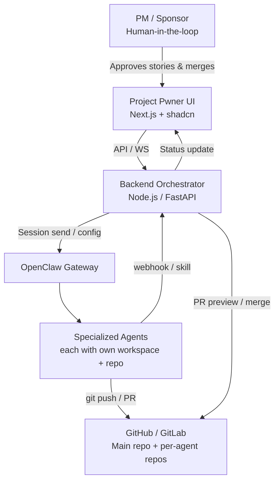

# Project Pwner Claw Manager – Architecture & Vision  
**Project Codename:** Project Pwner  
**Purpose:** A human-in-the-loop control plane and team-management UI that directs specialized OpenClaw agents to execute software projects.  
**Core Philosophy:** Treat AI agents like a distributed dev team with strict approval gates, isolated workspaces/repos, and version-control hygiene. No unnecessary anthropomorphism.

**Last Updated:** February 2025 (initial draft)  
**Owner:** pvt goose (@icuragoose)  
**Anchor for Agents:** Any agent working on Project Pwner MUST read this file at session start and reference sections when proposing changes.

## 1. High-Level Overview

Project Pwner sits **on top of OpenClaw** and provides:

- **Task orchestration** with human gates (PM/sponsor approves stories & merges)
- **Agent team management** (add/remove/configure roles, heartbeats, global/project instructions)
- **Isolated version control** per agent to prevent conflicts
- **Suggestion inbox** from agents → backlog
- **UI/Dashboard** (Next.js-based) that feels like Linear + GitHub PRs



## 2. Core Components
### 2.1 Task Management

- Views: Kanban (primary), List, Roadmap
- Columns / States: Backlog → Ready → In Progress → Review → Preview → Done/Merged
- Gates:
  - PM must approve move from Backlog → Ready
  - Agent "done" → auto-PR → Review state
  - PM approves merge → Done

- Task card actions: Assign agent, Preview deploy, Open PR, Approve & Merge

### 2.2 Agent Management

- Registry stored in DB + synced to OpenClaw workspaces
- Per-agent config:
  - Name / slug
  - Role markdown (injected into SOUL.md or AGENTS.md)
  - Focus tags / keywords
  - Heartbeat cron + "proactive suggestions" toggle
  - Model / thinking level
  - Workspace path override
- Global instructions: Injected into all agents or via orchestrator prompt
- Lifecycle: Create → provision workspace + repo → register agent; Delete → cleanup

### 2.3 Version Control & Isolation Strategy

- Main repo — protected source of truth (main branch, PRs required)
- Per-agent repo — dedicated GitHub repo (e.g. clawmgr-agent-ui-designer)
  - Created on agent add
  - Fork/clone from main
  - Agent has write access only to its repo
  - Workflow:
    1. Task assigned → agent creates branch story/{task-id}-{slug}
    2. Works → commits → pushes
    3. Done → skill creates PR → main (or draft)
    4. PM reviews diff / preview deploy → approves merge
- Preview deploys: Vercel / Netlify / Render API triggered on PR
- Revert: Hard reset agent's repo to main if needed

### 2.4 Suggestion Inbox

- Agents (or humans) submit via custom skill → webhook → inbox
- PM reviews → approve to Backlog or reject/archive
- Per-agent on-demand suggestion button
- Per-agent toggle: "Suggest new stories at heartbeat"

## 3. Key Flows
### Story Execution Flow

1. PM/Sponsor creates story → Backlog
2. PM moves to Ready → backend assigns to agent + sends OpenClaw message
3. Agent works in its repo → pushes → skill notifies done + creates PR
4. Task → Review; PM sees PR link + preview button
5. PM approves → backend merges PR → task Done → agent notified

### Agent Creation Flow

1. PM adds agent via UI
2. Backend:
    - Creates GitHub repo
    - Provisions OpenClaw workspace (or subfolder)
    - Writes SOUL.md / AGENTS.md with role
    - Registers agent via openclaw agents add
3. Agent appears in team view

4. Data Model Sketch (PostgreSQL)
```sql
projects (
  id, name, main_repo_url, github_token_enc, status
)

agents (
  id, project_id, name, slug, workspace_path, role_md, heartbeat_cron,
  suggestion_enabled boolean, model, thinking_level, status
)

tasks (
  id, project_id, title, description, status enum,
  assignee_agent_id, pr_url, preview_url, created_at, approved_at
)

suggestions (
  id, project_id, from_agent_id, title, body, status enum
)
```

## 5. Tech Stack & Integration Points

- Frontend: Next.js 15 (App Router), Tailwind, shadcn/ui, TanStack Query + Table/Kanban
- Backend: Node.js (preferred for OpenClaw ecosystem) or Python FastAPI
- DB: PostgreSQL (Neon/Supabase)
- Auth: Clerk / Supabase Auth
- OpenClaw integration: WS client to gateway (session.send, config.apply)
- Git: Octokit + simple-git
- Previews: Vercel API or similar

## 6. Open Questions / Future Extensions

- Multi-project support in one UI instance?
- Agent-to-agent handoff protocol?
- Auto-testing / linting gate before PR?
- Cost tracking & model quotas per project
- Export/import project configs

## 7. Agent Instructions (Enforce in AGENTS.md / SOUL.md)

- Always reference this ARCHITECTURE.md when reasoning about system changes.
- Never propose changes that weaken human approval gates.
- When suggesting new stories/features, use the suggestion skill/webhook.
- Keep per-agent repos isolated — never touch main repo directly.

Feel free to iterate on this doc — propose PRs against it!